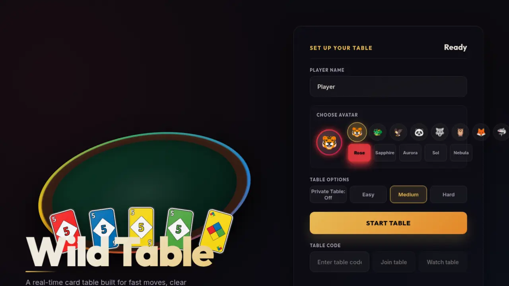

# Demo: Turn-Based UNO Card Game


A multiplayer UNO card game built with [Colyseus](https://colyseus.io/). Multiple frontend implementations share the same authoritative game server and shared UNO rules.

## Project Structure

The `server/` directory contains the shared game server powered by Colyseus 0.17.

| Client | Directory | Rendering | Platforms | Screenshot |
|---|---|---|---|---|
| React web | [`web-react/`](web-react/) | DOM/CSS | Web |  |
| Haxe + Heaps | [`haxe/`](haxe/) | 2D | Web, Desktop |  |
| GameMaker | [`gamemaker/`](gamemaker/) | 2D | Desktop, Web |  |
| Defold | [`defold/`](defold/) | 2D | Desktop, Web |  |
| Godot | [`godot/`](godot/) | 2D | Desktop, Web |  |
| Unity | [`unity/`](unity/) | 3D | Desktop, Web, Mobile |  |

## Getting Started

Start the server:

```bash
cd server
npm install
npm run dev
```

See each client's README for setup instructions.

## Quickstart

For the fastest local setup (server + web client), see [QUICKSTART.md](QUICKSTART.md). You can also use `./scripts/run-web-demo.sh` to start both services.

## Verification

The maintained web path is covered by server rule tests, web client unit tests, a browser smoke test, and CI workflows:

```bash
cd server && npm test
cd server && npm run build
cd web-react && npm run test:unit
cd web-react && npm run lint
cd web-react && npm run build
./scripts/smoke-web-agent-browser.sh
```

Server tests include autoplay coverage for full game completion and turn-limit exhaustion. The smoke test starts the server and React client, joins a live table in desktop and mobile viewports, attempts a real play/draw interaction, checks browser console/page errors, and writes screenshots under `.tmp-agent-browser/`.
Web client unit tests cover the extracted room helpers and shared command utilities.

## Assets

Card art from [4Colour Cards](https://verzatiledev.itch.io/4colour) by VerzatileDev.

## Disclaimer

"UNO" is a registered trademark of Mattel, Inc. This project is not affiliated with, endorsed by, or sponsored by Mattel. It is an independent, open-source fan project created for educational and demonstration purposes only.

## License

MIT — See [LICENSE](LICENSE) file.
