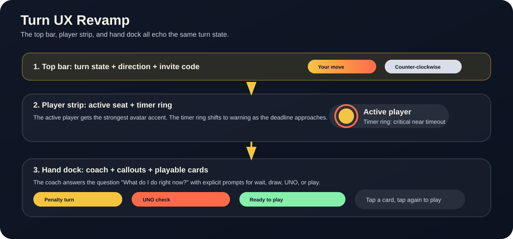

# Turn UX Revamp

This document explains the turn-playing UX overhaul for the React client and how the UI now surfaces turn state more clearly from lobby to match end.

## Visual Reference

The current screenshot in the repo gives a general sense of the table layout:

For the revamp itself, this annotated flow diagram shows how the main turn surfaces work together:

## Why This Revamp Exists

The previous turn flow required players to infer too much from the board state. A turn could be technically legal while still feeling ambiguous: should the player draw, play, call UNO, or wait for a penalty to resolve?

The revamp makes the turn state explicit in three places at once:

1. The top bar states whose move it is.
2. The hand dock tells the player what to do next.
3. The board surfaces penalties, invalid choices, and ready-to-play cards with stronger visual cues.

The result is less guesswork, faster turns, and fewer missed UNO calls.

## Turn State Model

The client does not rely on a single server enum for every turn prompt. Instead, `useTableRoomController` derives a UX state from the room state and the local hand:

- `waiting` - the local player is not active, or the table has not reached the first move yet.
- `my move` - it is the local player's turn and they may either play or draw.
- `draw penalty` - `pendingDraw > 0`, so the deck is the required move.
- `UNO check` - the local player is at one card and must call UNO before the next play.
- `invalid selection` - a chosen card does not match the current discard state.
- `no legal play` - the local player is active but has no playable cards.
- `ready-to-play` - a selected card is legal and can be committed immediately.

These are synthesized in `src/components/tableRoomControllerLogic.ts` and consumed by the hand dock and overlay surfaces.

## UI Surfaces Involved In A Turn

### Top Bar Turn State

The top bar gives the quickest summary of turn ownership. `src/components/TableTopbar.tsx` shows:

- The invite code.
- A turn-state label, which flips between `Your move` and `<player> to act`.
- A turn-order label that reads `Clockwise` or `Counter-clockwise`.

This keeps the current actor visible even when the board is crowded or the player is watching a penalty resolve.

### Turn Banner

`src/components/TableTurnBanner.tsx` gives each turn handoff a short, readable overlay:

- The banner keeps the active player name front and center.
- The subtitle now explains the immediate next move, such as drawing a penalty stack or calling UNO.
- The overlay is intentionally brief so it reinforces the handoff without interrupting the turn flow for too long.

### Active-Player Strip And Timer Ring

`src/components/PlayerStrip.tsx` highlights the active seat and attaches `src/components/TurnTimerRing.tsx` to the active avatar.

- The active player gets an orbital accent around their avatar.
- The timer ring animates toward critical state as the deadline approaches.
- Skip/reverse effects can temporarily mark a player as skipped so the turn flow is easier to read.

This is the board-level source of urgency. It tells everyone whose move is live without requiring them to inspect the discard pile.

### Turn Coach In The Hand Dock

`src/components/TableHandDock.tsx` renders `TableTurnCoach`, the main local instruction surface.

`src/components/TableTurnCoach.tsx` presents:

- An eyebrow label such as `Waiting`, `Penalty turn`, `UNO check`, or `Ready to play`.
- A short title and subtitle.
- A primary action button such as `UNO!`, `Draw card`, or `Play selected` when the player can act.
- A fallback `Draw card` action, a `Rules` shortcut, and `Clear selection` when they need an alternate path.
- A step list that breaks the turn into readable sub-actions.
- A color hint that repeats the current active color.

The coach is the clearest place to learn the next move. It is designed to answer the question: "What do I do right now?"

### Draw Deck, Hand Cards, And Action Callouts

`src/components/TableRoom.tsx` and `src/components/TableHandDock.tsx` split responsibility between the board and the hand.

- The draw deck is a direct tap target and pulses when drawing is the best available action.
- The local hand shows playable cards with stronger emphasis.
- `src/components/HandCardItem.tsx` supports tap, select, and swipe interactions on individual cards.
- `buildActionCallout` in `src/components/tableRoomControllerLogic.ts` injects explicit penalties or UNO reminders above the hand.

The client uses these surfaces together so a player can read the board, select a card, and commit the move without opening a separate help layer.

### Tutorial And Rules Drawer

`src/components/TableTutorialGuide.tsx` introduces the core turn loop for first-time players:

- read the discard,
- draw if stuck,
- play from the hand,
- call UNO when down to one card.

`src/components/TableRulesDrawer.tsx` is the deeper reference layer. Its header reads `Rules & shortcuts`. It lists keyboard shortcuts, explains draw penalties, and documents the special-card rules.

The walkthrough is short and progressive. The rules drawer is the durable reference for players who want details.

### Lobby Onboarding Language

`src/components/Lobby.tsx` sets expectations before the game begins:

- The product copy emphasizes fast moves and clear matching.
- The player name, private room, and difficulty controls are all on one screen.
- The join/watch flow makes it obvious that the same room can be played or observed.

This onboarding matters because turn UX is easier to understand when the lobby already frames the game as a quick, readable table rather than a hidden state machine.

## Input And Interaction Rules

### Click And Tap To Select And Play

- Clicking a hand card selects it.
- Clicking the selected playable card plays it.
- Clicking an unplayable card triggers feedback instead of sending an invalid move.

### Draw Behavior

- Clicking the deck draws a card when the local player is allowed to act.
- If a draw penalty is active, the deck is still the required action.
- When no legal play exists, the coach and guidance text both push the player toward drawing.

### UNO Timing

- The UNO call is required when the local player reaches one card and the room says UNO is pending.
- The primary UNO button appears in the hand dock when it is available.
- Keyboard `U` also triggers the call when the local seat is the active UNO caller.

### Keyboard Shortcuts

The rules drawer lists the live shortcuts:

- `Arrow Left` and `Arrow Right` move between hand cards.
- `Space` or `Enter` plays the selected legal card.
- `D` draws from the deck.
- `U` calls UNO when it is legal to do so.
- `C` focuses chat.
- `R`, `Y`, `G`, and `B` choose a wild color.
- `Escape` closes the wild color dialog or the rules drawer.
- `?` toggles the rules drawer.

### Mobile Gesture Behavior

The mobile card interaction lives in `src/components/HandCardItem.tsx`.

- Swiping up on a card commits the play if the card is legal.
- Swiping down on a selected card clears the selection.
- A light tap selects a card; tapping the selected legal card plays it.
- The draw deck itself remains a tap target rather than a swipe target.

## Accessibility And Readability Choices

The revamp leans on plain action language and redundant signals.

- The coach uses short verbs such as `Draw`, `Play`, and `UNO`.
- The top bar repeats the turn state so players do not have to scan the whole board.
- The top bar and drawer use sentence case labels such as `Your move`, `Rules & shortcuts`, and `Counter-clockwise`.
- The active color is shown as both a color chip and text.
- Colorblind mode adds symbols for red, blue, green, and yellow.
- Penalties and invalid selections use warning and error tones instead of a single neutral style.
- The active-player ring and warning pulses create urgency without requiring the player to decode a hidden timer.

## Before Vs After

### Before

- Turn state was implied more than stated.
- Players had to infer when to draw, when to play, and when UNO was required.
- Mobile and keyboard paths were easy to miss if you did not know the shortcuts.

### After

- The top bar, coach, and board all agree on the current turn state.
- The UI distinguishes waiting, penalties, invalid picks, and ready plays.
- The rules are discoverable in the lobby, the tutorial, and the drawer.
- Play, draw, and UNO are all surfaced as explicit actions instead of buried behaviors.

## Where The Logic Lives

- `src/components/useTableRoomController.ts`
  - Derives `isMyTurn`, `pendingDraw`, `mustCallUno`, `selectedCard`, `isSelectedPlayable`, `turnCoach`, `guidanceText`, and `actionCallout`.
  - Handles keyboard shortcuts, play requests, draw requests, and wild-color resolution.
  - Drives the ephemeral overlays such as turn banners, card alerts, and tutorial state.
- `src/components/tableRoomControllerLogic.ts`
  - Builds the human-readable guidance copy and the structured turn coach state.
  - Centralizes the turn-state language so the hand dock and overlays stay in sync.
- `src/components/TableTopbar.tsx`
  - Shows the current turn label and overall match context.
- `src/components/PlayerStrip.tsx`
  - Marks the active player and attaches the timer ring.
- `src/components/TurnTimerRing.tsx`
  - Visualizes the current turn deadline and turns critical when time runs low.
- `src/components/TableHandDock.tsx`
  - Renders the coach, callouts, and local hand controls.
- `src/components/HandCardItem.tsx`
  - Implements card selection, tap-to-play, and mobile swipe behavior.
- `src/components/TableRoomOverlays.tsx`
  - Orchestrates the tutorial, rules, turn banner, card alerts, reverse sweep, and wild-color modal.
- `src/components/TableTutorialGuide.tsx`
  - Introduces the turn loop to new players.
- `src/components/TableRulesDrawer.tsx`
  - Documents shortcuts and the game rules.
- `src/components/Lobby.tsx`
  - Frames the table before the first turn begins.

## Maintainer Notes

The UX contract is now split between server state and local presentation state. If you change turn behavior later, update both the controller logic and the copy in this document so the board, coach, and help surfaces stay aligned.
